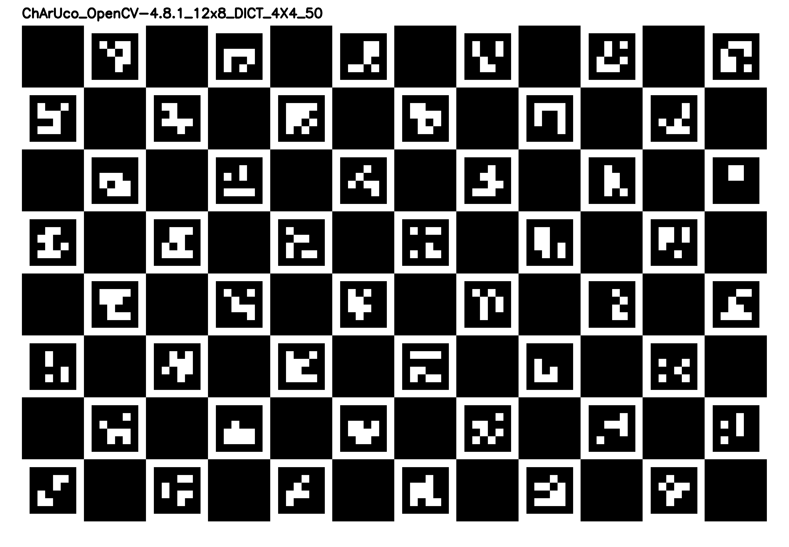
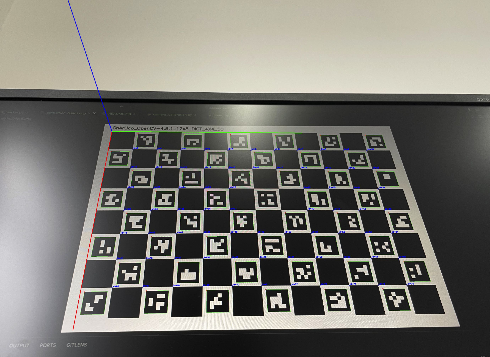

# Camera Calibration

[中文](./README_CN.md) | [English](./README.md)

该仓库使用ChArUco码来标定摄像头，将摄像头标定流程化。

## 安装

`camera_calibration`要求`opencv-contrib-python`和`opencv-python`不低于4.7.0。在本地安装该软件包会自动获取其他所需的依赖项。

```bash
git clone https://github.com/Onicc/camera_calibration.git
cd camera_calibration
pip install -r requirements.txt
```

## 使用流程

### 生成并打印标定板
运行下面命令生成标定板，标定板的图片路径为`./calibration_board.png`。你也可以直接使用仓库中的[calibration_board.png](./calibration_board.png)。将其打印出来。

```bash
python3 generate_calibration_board.py
```



### 相机标定

测量标定板中纯黑色正方形的边长，单位为m，将其填入[camera_calibration.py](./camera_calibration.py)中第9行的`square_length`，即下面的`0.0024`。

```python
board, aruco_dict, board_name = ChArUcoBoard(width=12, height=8, square_length=0.024)
```

从不同角度拍摄标定板，采集大于20张，图片格式为`png`，图片存放路径为`./ChArUcoData`。运行下面命令进行标定，此时会显示标定图片，按下任意键切换下一张图片。

```
python3 camera_calibration.py
```

标定完成后命令行打印相机参数和畸变参数，同时参数也会保存在`./params/camera_params.yaml`。

```
camera_matrix:
 [[3.03536832e+03 0.00000000e+00 2.01985797e+03]
 [0.00000000e+00 3.03628900e+03 1.48595051e+03]
 [0.00000000e+00 0.00000000e+00 1.00000000e+00]]
distortion_coefficients:
 [[ 1.98927651e-01 -8.93785973e-01 -9.71016301e-05 -6.80081320e-04
   1.60146884e+00]]
Calibration successful. Calibration file used: ./params/camera_params.yaml
```

### 使用标定参数估计相机位姿

修改[detect_marker.py](./detect_marker.py)59行的图片文件路径，运行下面命令，会自动读取yaml中相机参数，并在ChArUco码上画出坐标轴，终端打印旋转向量和平移向量。

```
python3 detect_marker.py
```



```
rvec:  [[ 1.85860902]
 [ 1.83634612]
 [-0.55535779]]
tvec:  [[-0.11929498]
 [-0.04856779]
 [ 0.42148201]]
```

## Reference

https://github.com/Jcparkyn/dpoint

